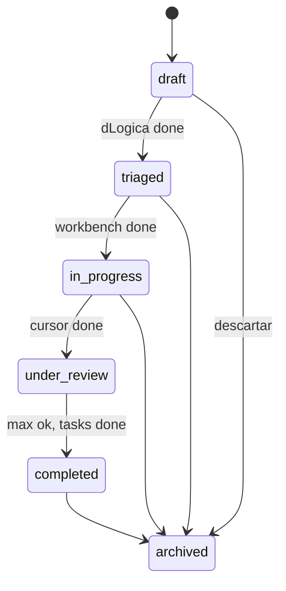

# Estados e fluxos — EcoMaestro

> Complementa [MODELO-CONDOMINIO.md](MODELO-CONDOMINIO.md) · Implementação: `db/migrations/001_ecomaestro_core.sql`

---

## 1. Estados da demanda (`demand_status`)

| Estado | Significado | Quem transiciona |
|--------|-------------|------------------|
| `draft` | Criada na UI; triagem feita; moradores ainda não concluíram dLogica | EcoMaestro ao salvar |
| `triaged` | `analysis.problem` + `objective` definidos (dLogica done) | Sistema ao fechar run dLogica |
| `in_progress` | Plano workbench + tarefas; Cursor em execução | Sistema ao fechar run workbench |
| `under_review` | Código entregue; Max registrou auditoria | Sistema ao fechar run Cursor ou Max parcial |
| `completed` | Plano cumprido; auditoria sem blockers | Sistema ou humano |
| `archived` | Encerrada ou descartada | Humano |

---

## 2. Estados da passagem (`resident_run_status`)

| Status | Uso |
|--------|-----|
| `pending` | Planejado pelo maestro (relatório) |
| `running` | Morador em execução |
| `done` | `output_payload` válido |
| `failed` | Erro ou gate não passou |
| `skipped` | Não aplicável nesta demanda |

---

## 3. Jornada na UI (v1 atual → v2)

### v1 (hoje — `index.html`)

| Passo | Ação usuário | Sistema |
|-------|--------------|---------|
| 1 | Abre app autônomo | Modo offline |
| 2 | Preenche GitHub + descrição | — |
| 3 | Analisar demanda | Classifica intent, monta relatório |
| 4 | Clica Abrir no morador | Navega para ferramenta externa |
| 5 | Histórico localStorage | Reabre demanda |

**Com API `:8771`:** lista demandas, export JSON, status manual, marcar run concluído, chips de portas.

### v2 (alvo — com Postgres)

| Passo | Ação |
|-------|------|
| 1 | Criar demanda → `demands` + `demand_reports` |
| 2 | Plano gera `demand_resident_runs` em `pending` |
| 3 | Ao concluir morador → `done` + merge payload + transição status |
| 4 | Dashboard: filtrar por status / intent |

---

## 4. Fluxo por intenção (sequência de runs)

| Intent | Ordem típica de `demand_resident_runs` |
|--------|----------------------------------------|
| ideia_nova | dlogica → workbench → cursor → max |
| feature_nova | workbench → cursor → max |
| auditar | max → workbench |
| fire | freedom → (workbench se produto) |
| pesquisar | cortana → workbench |
| correcao_rapida | workbench(50) → cursor → max |

`sequence_order` = 1, 2, 3… · `is_primary` = true só no Comece aqui.

---

## 5. Integração UI ↔ banco (contrato API futuro)

Endpoints sugeridos (REST):

| Método | Rota | Função |
|--------|------|--------|
| POST | `/demands` | Criar + triagem (body = link + description) |
| GET | `/demands/:id` | Demanda + report + runs |
| PATCH | `/demands/:id/status` | Transição manual |
| POST | `/demands/:id/runs/:resident/complete` | Fechar passagem + payload |

**v1 local:** export JSON do relatório (botão futuro) colável em `payload_snapshot`.

---

## 6. O que a análise externa acertou — e onde estamos

| Observação | Situação após este pacote |
|------------|---------------------------|
| Só conceito no MODELO-CONDOMINIO | **Mitigado:** CONTRATOS, ESTADOS, SQL, exemplo |
| UX sem jornada de concluir | **v2** — UI ainda v1; fluxo documentado |
| Só localStorage | SQL pronto; UI ainda localStorage |
| Extras sem playbook | Playbooks em CONTRATOS §7 |
| Falta contrato entrada/saída | payload v1 + schema JSON |

**Protótipo UI** (`index.html`) já implementa triagem + relatório; **backend** fica especificado para implementação no repo EcoMaestro ou geogrowth-sync-api.
