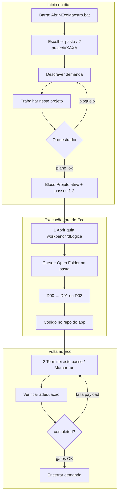

# EcoMaestro como gestor de jornada — auditoria (2026-05-30)

> Leitura antes de **fechar etapa** ou **testar** o fluxo completo.  
> Complementa: [MODELO-CONDOMINIO.md](MODELO-CONDOMINIO.md) · [ORQUESTRADOR-ADEQUACAO.md](ORQUESTRADOR-ADEQUACAO.md) · [ESTADOS-E-FLUXOS.md](ESTADOS-E-FLUXOS.md)

---

## 1. Papel correto do Eco

| É gestor de jornada | Não é |
|---------------------|--------|
| Triagem (intent, Comece aqui) | IDE / editor de código |
| Plano “o que precisa” + ordem dos moradores | Executor de backup, build, deploy |
| Registro de demandas (`data/demands/`) | Substituto do Git |
| Orquestrador de adequação (pedido vs execução) | Alterador automático dos apps em `_PROJETOS` |
| Links e prompts (workbench, Max, produtos) | Cursor em si |

**Metáfora:** síndico do condomínio — não pinta o apartamento; diz qual morador entra e em que ordem.

---

## 2. Jornada canônica (um dia de trabalho)

---

## 3. Rotina recomendada (checklist operacional)

### Abertura (1× por sessão)

- [ ] `Abrir-EcoMaestro.bat` ou atalho na barra (API `:8771`)
- [ ] Faixa verde ou amarela no topo — sem vermelho “bloqueou”
- [ ] Projeto certo na lista + bloco **Projeto ativo: NOME**
- [ ] **Trabalhar neste projeto** (não só selecionar na lista)

### Por morador (repetir)

- [ ] Botão **1 — Abrir** (guia do passo atual)
- [ ] Trabalho real no Cursor / Max / workbench
- [ ] Botão **2 — Terminei** ou **Marcar concluído** na lista Passagens
- [ ] **Verificar adequação** — conferir ✓/✗

### Fechamento do dia

- [ ] Demandas do projeto em `data/demands/` (API ligada)
- [ ] Não marcar `completed` se orquestrador listar gates falhando
- [ ] `Parar-EcoMaestro-API.bat` só se quiser liberar porta 8771

---

## 4. O que está implementado (v1.2)

| Área | Status |
|------|--------|
| Scan ~24 apps em `_PROJETOS` | OK (`GET /api/projects`) |
| Trabalhar + salvar demanda | OK (`POST /api/demands`) |
| Relatório + moradores + links `/p/` | OK (16/16 links testados) |
| Orquestrador adequação v2 + gates | OK |
| Bloqueio pedido vago / desalinhado | OK (422) |
| Bloqueio ordem de runs / completed | OK (422) |
| Histórico por projeto | OK (`?project=`) |
| UI leitura fácil + passos 1-2 | OK |
| Atalho barra + `?project=` | OK |
| Modo autônomo (sem API) | OK (limitado) |
| Postgres | Opcional (`DATABASE_URL`) |

---

## 5. Lacunas para gestor de jornada (antes de “fechar”)

| Prioridade | Lacuna | Impacto |
|------------|--------|---------|
| **P0** | **Marcar concluído** só grava `ui_note` — não preenche `analysis.*`, `plan.steps`, etc. | Status avança, mas **completed** continua bloqueado; orquestrador sempre “parcial” |
| **P0** | Eco **não** abre Cursor nem injeta contexto no chat | Usuário precisa copiar pasta + D00 manualmente |
| **P1** | Docs antigos citam só modo autônomo / porta 8770 | Confusão com `:8771` API |
| **P1** | Sem “painel do dia” (todas demandas abertas, por status) | Gestão de várias jornadas paralelas é manual |
| **P2** | Sem integração Max/Cursor automática (webhook) | Esperado — fora do escopo v1 |
| **P2** | `Marcar concluído` não pergunta saída mínima do contrato | Próximo passo: mini-formulário por morador |

---

## 6. Roteiro de teste antes de encerrar

1. `Criar-atalho-Barra-de-Tarefas.bat` → fixar `Abrir-EcoMaestro.bat`
2. `Abrir-EcoMaestro.bat XAXA` → lista com XAXA + bloco amarelo
3. Demanda clara → **Trabalhar** → orquestrador `plano_ok` ou `adequado`
4. **1 Abrir** → README coding diário abre em `:8771/p/...`
5. Cursor em `c:\_PROJETOS\XAXA` + D00
6. **2 Terminei** → run `pending` → `done`
7. Repetir para próximo morador na ordem (não pular — testar bloqueio 422)
8. Tentar `completed` no select — deve **bloquear** até payload real (comportamento esperado hoje)
9. `GET /api/demands?project=XAXA` — histórico aparece na UI
10. `node scripts/test-links.mjs` + `test-orchestrator.mjs` — 0 missing

---

## 7. Decisão de produto (sua pergunta: Eco antes ou depois da pasta?)

| Abordagem | Veredito |
|-----------|----------|
| **Eco → depois Cursor** | **Recomendado** — jornada governada, projeto não é “mexido” sem plano |
| Cursor primeiro → Eco depois | Válido só para **registrar** o que já fez; triagem fraca |
| Eco modificar o app | **Não** — manter Eco como gestor, Cursor como executor |

---

## 8. Próximos incrementos (se virar “gestor completo”)

1. Wizard ao **Marcar concluído**: 2 campos por morador (`problem`/`objective`, `plan.steps`, …)
2. Botão **Abrir no Cursor** (protocolo `cursor://` ou copiar D00 + pasta)
3. Página **Minhas jornadas** (filtro status / projeto)
4. Atualizar [ANALISE-FUNCIONAL.md](ANALISE-FUNCIONAL.md) para API `:8771` como padrão

---

*Auditoria alinhada ao código em `main` (orquestrador, gates, UI passos 1-2, atalhos).*
