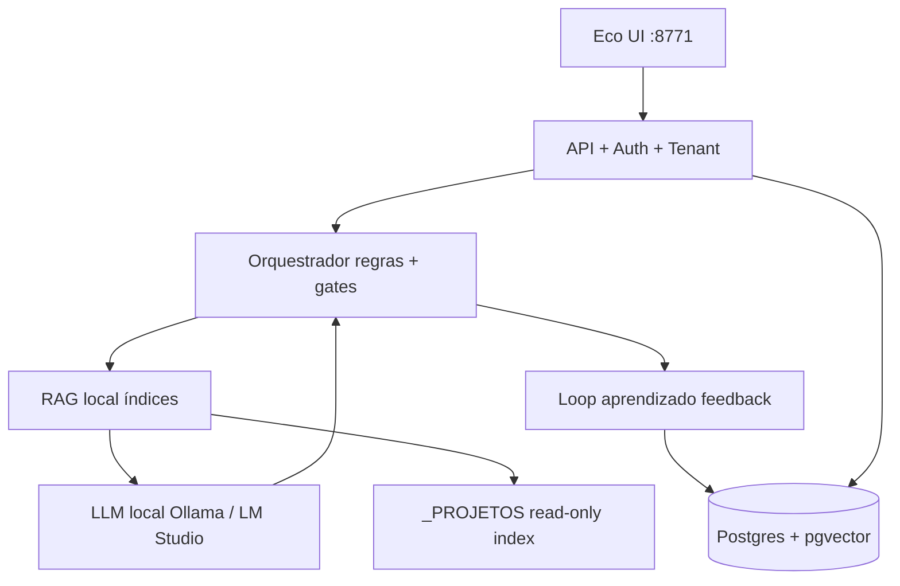

# EcoMaestro enterprise — RAG local + LLM com loop de aprendizado

Visão técnica para evoluir do **gestor de jornada v1** (regras + JSON) para **plataforma enterprise** no seu PC ou VPS, sem perder LGPD.

---

## Camadas alvo



---

## Fase E0 — Fundação (já iniciada)

| Item | Estado |
|------|--------|
| API key + tenant | `api-guard.mjs`, migration 002 |
| Gates / contratos | `demand-orchestrator.mjs` |
| Postgres opcional | `storage-pg.mjs` |

---

## Fase E1 — Enterprise operacional (4–6 semanas)

| # | Entrega | Detalhe |
|---|---------|---------|
| 1 | **Auth real** | JWT ou session + `tenant_id` no token; UI envia headers |
| 2 | **RLS Postgres** | Políticas `tenant_id = current_setting('app.tenant_id')` |
| 3 | **Audit log** | Tabela `audit_events` (quem leu/alterou demanda) |
| 4 | **Criptografia** | Demandas com PII: campo `description_enc` ou disco cifrado |
| 5 | **Rate limit** | Por tenant na API |
| 6 | **Wizard payload** | Desbloqueia `completed` com contratos reais |

---

## Fase E2 — RAG local (conhecimento do ecossistema)

### O que indexar (por tenant + global)

| Fonte | Uso no RAG |
|-------|------------|
| `workbench/**/*.md` | Kits, D00–D12, infra |
| `EcoMaestro/docs/**` | Contratos, jornada |
| `AGENTS.md` / `README` por projeto | Contexto do app ativo |
| Demandas **anonimizadas** | Padrões de roteamento que funcionaram |

### Stack sugerida (100% local)

| Componente | Opção |
|------------|--------|
| Embeddings | `nomic-embed-text` via Ollama |
| Vetores | **pgvector** no mesmo Postgres ou **sqlite-vec** leve |
| Chunking | 512–800 tokens, overlap 80 |
| Retrieval | híbrido: BM25 (keywords atuais) + top-k vetorial |

### Pipeline

1. Job `npm run index:eco` — varre pastas permitidas (respeita deny-list do `/p/`).
2. Ao **Trabalhar neste projeto**, injeta top-5 chunks no contexto do relatório (não no Cursor automaticamente).
3. Citação obrigatória: link `/p/...` no relatório (rastreabilidade LGPD).

---

## Fase E3 — LLM com loop de aprendizado

### Papel do LLM (não substitui gates)

| Tarefa | LLM | Regras atuais |
|--------|-----|----------------|
| Classificar intent vago | Sim | Validação final por `KW[]` |
| Resumir demanda | Sim | — |
| Escolher ordem moradores | Sugestão | **Gate** confirma ordem fixa |
| Marcar completed | **Não** | Só humano + payload |

### Loop de aprendizado (fechado e auditável)

```text
1. Usuário conclui run com payload real
2. Sistema grava: intent, descrição_hash, plano, outcome (adequado/desalinhado)
3. Embeddings da tripla (descrição + intent + moradores) → tabela learning_cases
4. Próxima demanda similar: RAG recupera 3 casos → LLM propõe intent
5. Se usuário corrige intent → feedback negativo → downrank do caso
```

**Importante LGPD:** não indexar descrição bruta com PII; usar hash + categorias + intent, ou anonimização local antes do embed.

### Métricas do loop

| Métrica | Meta |
|---------|------|
| Intent correto sem edição | > 75% após 50 casos |
| Tempo até primeiro morador | < 2 min |
| Taxa 422 por pedido vago | estável (gates não afrouxam) |

---

## Fase E4 — Deploy enterprise

| Modo | Quando |
|------|--------|
| **Desktop** | Hoje — 127.0.0.1 + Ollama local |
| **VPS single-tenant** | API key + TLS + backup |
| **Multi-tenant SaaS** | RLS + billing + DPA — só se necessário |

---

## Ordem de implementação recomendada

1. E1 wizard + headers na UI  
2. E2 indexador RAG + pgvector  
3. E3 LLM intent assistido + learning_cases  
4. E4 TLS e backup  

**Não pular E0/E1** — RAG sem tenant isola mal e repete vazamento cross-tenant.

---

## Prompt seed (sessão enterprise)

```
EcoMaestro enterprise: tenant obrigatório, API key em produção.
RAG: workbench + docs Eco + README do projeto ativo.
LLM só sugere intent; gates e ordem dLogica→workbench→Cursor→Max são lei.
Learning loop: gravar outcome após run done; nunca embedar PII bruta.
```

---

*Auditoria: [AUDITORIA-SEGURANCA-EXECUCAO.md](AUDITORIA-SEGURANCA-EXECUCAO.md)*
